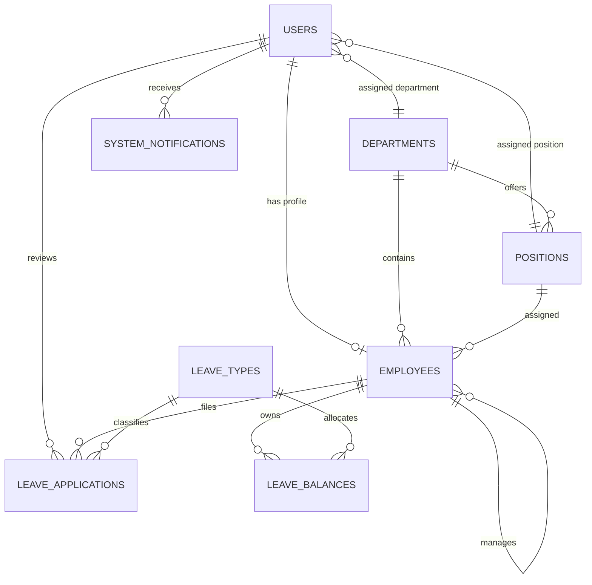

# Employee Leave Management System Documentation

## System Overview

The Employee Leave Management System is a Laravel 13 application for filing, approving, monitoring, and reporting employee leave requests.

Employees submit leave applications with leave type, date range, reason, and optional proof. The system validates requests against the employee's current-year leave balance. Managers review pending requests for employees in their team or department. HR Admins manage employee records, leave types, departments, user activation, reports, calendars, and CSV exports.

## Core Modules

| Module | Main Capability |
| --- | --- |
| Authentication and Roles | Fortify login, registration, password reset, active account checks, and role middleware |
| Employee Management | CRUD for employee records linked to user accounts |
| Department Management | HR management of departments and department managers |
| Leave Type Configuration | CRUD for leave types, annual allocation, approval, proof, active, and compensable settings |
| Leave Application | Employee, manager, and HR self-service leave filing with balance validation |
| Leave Approval Workflow | Manager and HR approve or reject requests with remarks |
| Reports and Dashboard | HR summaries, balances, department reports, calendar, and CSV export |
| Notifications | In-app notices for registration, activation, leave submission, and leave status changes |

## ER Diagram

## Important Tables

| Table | Purpose |
| --- | --- |
| `users` | Login credentials, role, status, pending employee ID, department, and position |
| `employees` | Employee profile, company employee ID, department, position, manager, gender, contact info, hire date, and status |
| `departments` | Department code, name, description, manager, and active flag |
| `positions` | Department-specific positions |
| `leave_types` | Leave type name, allocation, approval flag, proof rules, compensable flag, and active flag |
| `leave_balances` | Employee yearly allocation, used days, and computed remaining days |
| `leave_applications` | Filed leave requests, dates, total days, status, remarks, reviewer, and proof path |
| `system_notifications` | In-app notifications and read status |

## Routes and Controllers

| Area | Route Prefix | Main Controller Files |
| --- | --- | --- |
| HR Admin | `/admin` | `app/Http/Controllers/Admin/*`, delegated business logic in `app/Http/Controllers/Hr/HrController.php` |
| Manager | `/manager` | `app/Http/Controllers/Manager/ManagerController.php`, `LeaveApprovalController.php` |
| Employee | `/employee` | `app/Http/Controllers/Employee/*`, shared logic in `EmployeePortalController.php` |
| Auth | `/login`, `/register`, `/forgot-password` | Fortify setup in `app/Providers/FortifyServiceProvider.php` |
| Notifications | `/notifications/feed` | Closure route in `routes/web.php` using `SystemNotification` |

## Screenshots to Capture for Submission

Place final screenshots in `docs/screenshots/` before submission.

| Screenshot | Login As | Suggested URL |
| --- | --- | --- |
| Login page | Guest | `/login` |
| HR dashboard | HR Admin | `/admin/dashboard` |
| Employee directory | HR Admin | `/admin/employees` |
| Leave type configuration | HR Admin | `/admin/leave-types` |
| Master request log | HR Admin | `/admin/requests` |
| HR reports | HR Admin | `/admin/reports` |
| HR calendar | HR Admin | `/admin/calendar` |
| Manager dashboard | Manager | `/manager/dashboard` |
| Manager approval inbox | Manager | `/manager/approvals` |
| Employee dashboard | Employee | `/employee/dashboard` |
| Employee leave filing/history | Employee | `/employee/leaves` |
| Employee reports | Employee | `/employee/reports` |

## Default HR Account

| Field | Value |
| --- | --- |
| Name | Kathleen Barro |
| Email | `hr@company.com` |
| Employee ID | `HR-2000-001` |
| Password | `password` |
| Role | `hr_admin` |
| Gender | `female` |

## Technical Notes for Defense

- Routes are grouped by role in `routes/web.php`.
- Role checking is handled by `app/Http/Middleware/RoleMiddleware.php`.
- Active account enforcement is handled by `EnsureAccountApproved.php`.
- Form validation is handled by classes in `app/Http/Requests`.
- Relationships are defined inside `app/Models`.
- Leave approval updates used leave balance inside database transactions.
- In-app notifications are created through `App\Models\SystemNotification`.
