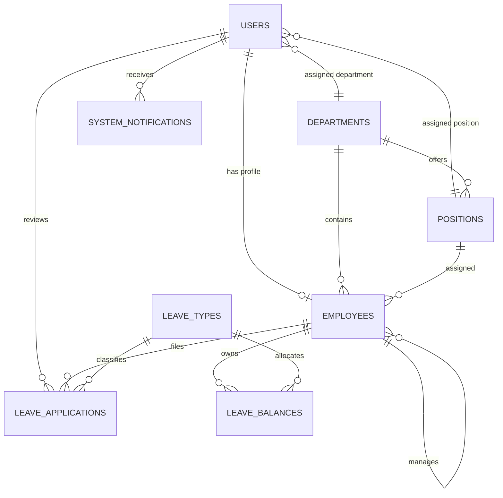

# Employee Leave Management System Documentation

## System Overview

The Employee Leave Management System is a Laravel 13 application for filing, approving, monitoring, and reporting employee leave requests.

Employees submit leave applications with leave type, date range, reason, and conditional proof uploads based on the selected leave type rules. The system validates requests against the employee's current-year leave balance. Managers review pending requests for employees in their team or department. HR Admins manage employee records, leave types, departments, user activation, reports, calendars, notifications, and CSV exports.

The current production UI is light-mode only. HR/Admin, Manager, and Employee dark-mode toggles were removed from active layouts and stylesheets.

## Core Modules

| Module | Main Capability |
| --- | --- |
| Authentication and Roles | Fortify login, registration, password reset, active account checks, and role middleware |
| Employee Management | CRUD for employee records linked to user accounts |
| Department Management | HR management of departments and department managers |
| Leave Type Configuration | CRUD for leave types, annual allocation, approval, proof, active, and compensable settings |
| Leave Application | Employee, manager, and HR self-service leave filing with balance validation |
| Leave Approval Workflow | Manager and HR approve or reject requests with remarks |
| Reports and Dashboard | HR summaries, balances, department reports, calendar, and CSV export |
| Notifications | In-app notices for registration, activation, leave submission, and leave status changes, with settled leave-request notifications removed from unread badge counts |

## ER Diagram

## Important Tables

| Table                  | Purpose |
| ---                    | --- |
| `users`                | Login credentials, role, status, pending employee ID, department, and position |
| `employees`            | Employee profile, company employee ID, department, position, manager, gender, contact info, hire date, and status |
| `departments`          | Department code, name, description, manager, and active flag |
| `positions`            | Department-specific positions |
| `leave_types`          | Leave type name, allocation, approval flag, proof rules, compensable flag, and active flag |
| `leave_balances`       | Employee yearly allocation, used days, and computed remaining days |
| `leave_applications`   | Filed leave requests, dates, total days, status, remarks, reviewer, and proof path |
| `system_notifications` | In-app notifications, read status, optional action URL, and optional related record metadata for leave-request settlement |

## Routes and Controllers

| Area          | Route Prefix          | Main Controller Files |
| ---           | ---                   | --- |
| HR Admin      | `/admin`             | `app/Http/Controllers/Admin/*`, delegated business logic in `app/Http/Controllers/Hr/HrController.php` |
| Manager       | `/manager`           | `app/Http/Controllers/Manager/ManagerController.php`, `LeaveApprovalController.php` |
| Employee      | `/employee`          | `app/Http/Controllers/Employee/*`, shared logic in `EmployeePortalController.php` |
| Auth          | `/login`, `/register`, `/forgot-password` | Fortify setup in `app/Providers/FortifyServiceProvider.php` |
| Home Redirect | `/`, `/home` | `app/Http/Controllers/HomeController.php` |
| Positions API | `/positions-by-department/{department}` | `app/Http/Controllers/PositionController.php` |
| Notifications | `/notifications/feed`, `/notifications/{notification}/read` | `app/Http/Controllers/NotificationController.php` |

## Current View and UI Structure

| Area | Active Location |
| --- | --- |
| HR/Admin views | `resources/views/admin` |
| HR/Admin reports partial | `resources/views/admin/reports/_content.blade.php` |
| Manager views | `resources/views/manager` |
| Employee views | `resources/views/employee` |
| Employee shell layout | `resources/views/layouts/employee.blade.php` |
| HR-style pagination partial | `resources/views/vendor/pagination/hr.blade.php` |

The duplicate `resources/views/hr` folder was removed. HR Admin pages use the `admin.*` route names, `/admin` URLs, and `resources/views/admin` Blade files.

## Screenshots to Capture for Submission

Place final screenshots in `docs/screenshots/` before submission.

| Screenshot | Login As | Suggested URL |
| --- | --- | --- |
| Login page | Guest | `/login` |
| HR dashboard | HR Admin | `/admin/dashboard` |
| Employee directory | HR Admin | `/admin/employees` |
| Leave type configuration | HR Admin | `/admin/leave-types` |
| Master request log | HR Admin | `/admin/requests` |
| HR reports | HR Admin | `/admin/reports` |
| HR calendar | HR Admin | `/admin/calendar` |
| Manager dashboard | Manager | `/manager/dashboard` |
| Manager approval inbox | Manager | `/manager/approvals` |
| Employee dashboard | Employee | `/employee/dashboard` |
| Employee leave filing/history | Employee | `/employee/leaves` |
| Employee reports | Employee | `/employee/reports` |

## Default Demo Accounts

| Role | Email Login | Employee ID Login | Password |
| --- | --- | --- | --- |
| HR Admin | `hr@company.com` | `HR-2000-001` | `password` |
| Manager | `manager@company.com` | `OPS-5000-001` | `password` |
| Employee | `employee@company.com` | `OPS-5001-001` | `password` |

## Technical Notes for Defense

- Routes are grouped by role in `routes/web.php`.
- Role checking is handled by `app/Http/Middleware/RoleMiddleware.php`.
- Active account enforcement is handled by `EnsureAccountApproved.php`.
- Form validation is handled by classes in `app/Http/Requests`.
- Relationships are defined inside `app/Models`.
- Leave approval updates used leave balance inside database transactions.
- In-app notifications are created through `App\Models\SystemNotification`.
- Leave request notifications store related leave metadata and use `unreadActionable()` for badge counts.
- When a manager, HR admin, or employee cancellation settles a leave request, `SystemNotification::markLeaveRequestSettled()` marks matching unread leave-request notifications as read.
- Employee leave filing exposes `max_document_days` to the apply leave modal so proof upload appears only when required by leave type rules.

ERD
-------------------------------------------------------------------------------------------------------
The 8 Business Tables

Table	                 Purpose
users	                 Accounts (HR Admin, Manager, Employee roles)
employees	             Employee data linked to users
departments	             Org structure
positions	             Job titles per department
leave_types	             Leave categories you configure
leave_applications	     Leave requests (core feature)
leave_balances	         Annual leave balance tracking per employee
system_notifications	 In-app notifications, read status, action links, and related leave-request metadata

All 14 foreign keys = valid connections. No dangling references.

The 8 "Framework Tables"

Table	Answer
migrations	"Tracks which database migrations have run — Laravel's internal audit log."
sessions, password_reset_tokens	"Auto-generated by SESSION_DRIVER=database and Fortify in our .env."
cache, cache_locks, jobs, job_batches, failed_jobs	"Standard Laravel queuing/caching infrastructure. Present because CACHE_STORE=database and QUEUE_CONNECTION=database in our config — not actively used by our leave features."
Key line: "These are Laravel framework tables auto-generated by our migrations based on .env configuration — not part of our business logic."

Normalization Note
The `employees` table uses `department_id` and `position_id` foreign keys for department and job-title data. The old text columns `department` and `position` were removed in a cleanup migration. Blade pages can still display `$employee->department` and `$employee->position` because the `Employee` model exposes beginner-friendly accessors that read from the related `departments` and `positions` tables.

ROUTES
-------------------------------------------------------------------------------------------------------
LMS Routing System Explained
Your routing follows a role-based architecture:

Route Structure Overview

Public Routes (No Auth)
├── GET / → Login or Home
└── Auth Routes (login, register, password reset)

Protected Routes
├── /home → Role-based redirect
├── /positions-by-department/{id} → JSON API
├── /notifications/feed → Header notification JSON feed
├── /notifications/{notification}/read → Shared notification read redirect
│
├── HR Admin Routes (/admin prefix)
│   ├── Dashboard, Users, Employees
│   ├── Departments, Leave Types
│   ├── Leave Requests Review
│   ├── Reports & Calendar
│   └── My Leave, Profile
│
├── Manager Routes (/manager prefix)
│   ├── Dashboard
│   ├── Leave Approvals
│   ├── Team View, Calendar
│   ├── My Leave, Profile
│   └── Notifications
│
└── Employee Routes (/employee prefix)
    ├── Dashboard
    ├── Leave Applications (CRUD)
    ├── Reports & Balances
    ├── Notifications
    └── Profile

Role modules require `auth`, `profile.complete`, `account.approved`, and the matching `role:*` middleware. The shared notification feed requires `auth` and `account.approved`.

How Routing Works - Step by Step
1. User visits /home:

        <?php
        Route::middleware('auth')
            ->get('/home', [HomeController::class, 'redirectByRole'])
            ->name('home');

        // Inside HomeController:
        // HR Admin  -> admin.dashboard
        // Manager   -> manager.dashboard
        // Employee  -> employee.dashboard

2. Request goes to appropriate controller (based on role):

        HR User → App\Http\Controllers\Admin\DashboardController
        Manager → App\Http\Controllers\Manager\DashboardController
        Employee → App\Http\Controllers\Employee\DashboardController

3. Controller renders appropriate view:

        HR Admin → resources/views/admin/dashboard.blade.php
        Manager → resources/views/manager/dashboard.blade.php
        Employee → resources/views/employee/dashboard.blade.php

Key Middleware Applied
        Middleware	        Purpose
        auth	            User must be logged in
        account.approved	User status must be 'active'
        profile.complete	User profile must be complete
        role:hr	            Only users with 'hr' role
        role:manager	    Only users with 'manager' role
        role:employee	    Only users with 'employee' role

Example: HR Leave Type Management Route
<?php
Route::resource('leave-types', AdminLeaveTypeController::class)
    ->parameters(['leave-types' => 'leaveType'])
    ->except(['show']);

Auto-generates these 5 routes:
HTTP Method	      URL	                           Controller Method	Name
GET	              /admin/leave-types	           index()	            admin.leave-types.index
GET	              /admin/leave-types/create	       create()	            admin.leave-types.create
POST	          /admin/leave-types	           store()	            admin.leave-types.store
GET	              /admin/leave-types/{id}/edit	   edit()	            admin.leave-types.edit
PUT            	  /admin/leave-types/{id}	       update()	            admin.leave-types.update
(No show() because .except(['show']))

Route Protection Pattern
Every role-specific route group requires:
1. Authentication (auth middleware)
2. Account Active (account.approved)
3. Correct Role (role:hr|manager|employee)

For example:
        <?php
        Route::middleware(['account.approved', 'role:employee'])
            ->prefix('employee')
            ->group(function () {
                // Only active employees can access these routes
            });
This ensures a regular employee can't manually navigate to /admin/dashboard even if they guess the URL.
